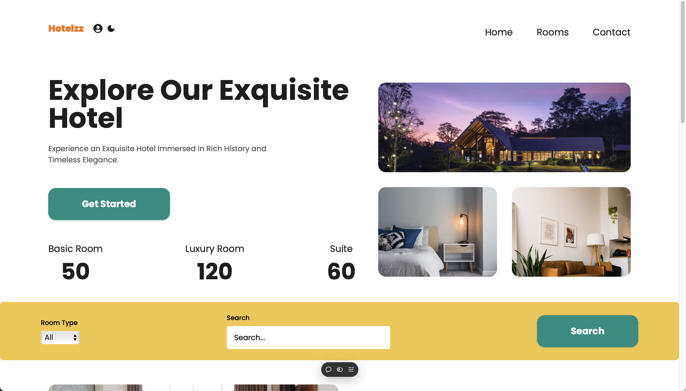

<a id="readme-top"></a>

<details>
  <summary>Table of Contents</summary>
  <ol>
    <li>
      <a href="#about-the-project">About The Project</a>
      <ul>
        <li><a href="#built-with">Built With</a></li>
      </ul>
    </li>
    <li>
      <a href="#getting-started">Getting Started</a>
      <ul>
        <li><a href="#prerequisites">Prerequisites</a></li>
        <li><a href="#installation">Installation</a></li>
      </ul>
    </li>
    <li><a href="#usage">Usage</a></li>
    <li><a href="#contact">Contact</a></li>
    <li><a href="#acknowledgments">Acknowledgments</a></li>
  </ol>
</details>

## About The Project

\


This is a fullstack hotel management system. The website lists various hotel rooms to search, book and leave reviews. To make a booking, authentication is required, and payments are made via Stripe. The content is managed using Sanity CMS.

### Built With

* [![Next][Next.js]][Next-url]
* [![React][React.js]][React-url]
* [![Sanity][Sanity.io]][Sanity-url]
* [![Typescript][Typescript]][Typescript-url]
* [![Tailwindcss][Tailwindcss]][Tailwind-url]
* [![Stripe][Stripe]][Stripe-url]
* [![Vercel][Vercel]][Vercel-url]

<p align="right">(<a href="#readme-top">back to top</a>)</p>

## Getting Started
The project is deployed by Vercel and is available at [https://hotel-management-three-rho.vercel.app](https://hotel-management-three-rho.vercel.app/).\
Followings are instructions to run locally.

### Prerequisites
* npm
  ```sh
  npm install npm@latest -g
  ```
### Installation
1. Contact [cshencm@gamil.com](cshencm@gamil.com) to get a set of free api keys and put inside ```.env``` file. Althernatively, get free api keys from: [Sanity](https://www.sanity.io), [Google Cloud](https://cloud.google.com), [Github Oauth Apps](https://github.com), [Stripe Api Keys](https://dashboard.stripe.com) and [Stripe Webhooks](https://dashboard.stripe.com).
2. Clone the repo
   ```sh
   git clone https://github.com/github_username/repo_name.git
   ```
3. Install NPM packages
   ```sh
   npm install
   ```
4. run in developer mode
    ```sh
    npm run dev
    ```
<p align="right">(<a href="#readme-top">back to top</a>)</p>

## Usage

* Hotel rooms management CRUD with sanity.io (need read and write access)
* Authentication by email, github or gmail.
* Room booking
* Checkout with Stripe
* Hotel room reviews
* Search (room type/ name)
* Light/dark mode switch

<p align="right">(<a href="#readme-top">back to top</a>)</p>


## Contact
Email: cshencm@gamil.com

Project website: [https://hotel-management-three-rho.vercel.app](https://hotel-management-three-rho.vercel.app/)

<p align="right">(<a href="#readme-top">back to top</a>)</p>

## Acknowledgments

* [Sanity documentation](https://www.sanity.io/docs?gad_source=1&gbraid=0AAAAA99_fprVSqPr8nVT31vdrQmlfGcg_&gclid=CjwKCAjw1NK4BhAwEiwAVUHPUHvJ_Fz5NDXnTIP2slvWrUQyqph9hYvGRq9fW3Ud3QTLoyf6GolBoBoCFX0QAvD_BwE)
* [Stripe webhook endpoint](https://docs.stripe.com/webhooks/quickstart)
* [Auth.js guide](https://authjs.dev/guides/debugging)
* [Typescript documentaion](https://www.typescriptlang.org/docs/)
* [Tailwind documentaion](https://v2.tailwindcss.com/docs)
* [useSwr hook](https://swr.vercel.app/docs/getting-started)
* [Font awesome](https://fontawesome.com)
* [React icons](https://react-icons.github.io/react-icons/search/)
* [README template](https://github.com/othneildrew/Best-README-Template?tab=readme-ov-file)

<p align="right">(<a href="#readme-top">back to top</a>)</p>


[Next.js]:  https://img.shields.io/badge/next.js-000000?style=for-the-badge&logo=nextdotjs&logoColor=white
[Next-url]: https://nextjs.org/
[React.js]: https://img.shields.io/badge/React-20232A?style=for-the-badge&logo=react&logoColor=61DAFB
[React-url]: https://reactjs.org/
[Sanity.io]:https://img.shields.io/badge/sanity-F03E2F?style=for-the-badge&logo=sanity&logoColor=white
[Sanity-url]:https://www.sanity.io
[Tailwindcss]:https://img.shields.io/badge/Tailwind_CSS-38B2AC?style=for-the-badge&logo=tailwind-css&logoColor=white
[Tailwind-url]:https://tailwindcss.com
[Stripe]:https://img.shields.io/badge/Stripe-626CD9?style=for-the-badge&logo=Stripe&logoColor=whit
[Stripe-url]:https://stripe.com
[Vercel]:https://img.shields.io/badge/Vercel-000000?style=for-the-badge&logo=vercel&logoColor=white
[Vercel-url]:https://vercel.com/
[Typescript]:https://img.shields.io/badge/TypeScript-007ACC?style=for-the-badge&logo=typescript&logoColor=white
[Typescript-url]:https://www.typescriptlang.org